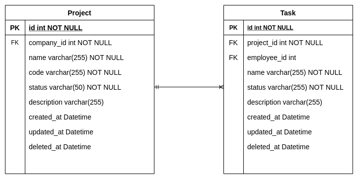
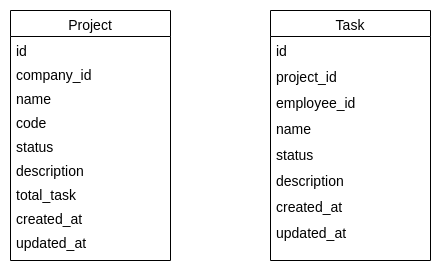

# Let's GO Project

## What to do
In this service, you will develop a backend server side functions that handle the **project** and **task** API
resources.This service will contain 2 sub-services which are the Rest and gRPC service.
Rest service will handle the http requests while gRPC will handle the rpc request to the API resources.

The project and task ERD can be referred below: \

The project and task Pbtype can be referred below: \

## Expected Output
* Create service command using cobra.
* Bring up service by Docker compose successfully.
* Create project and task service, message using Pbtype.
* Create project and task model, migration.
* Expose project API resources endpoint which includes:
    * Create a project for a specific company.
    * Get a project by an id.
    * Update a project by an id.
    * Delete a project by an id.
    * list a project by company id, page and limit.
* Expose task API resources endpoint which includes:
    * Create a number of tasks for a specific project.
    * Get a task by an id.
    * Update a task by an id.
    * Delete a task by an id.
    * list a task by project id, page and limit.
* Calculate the total task for a project.
* Calculate the total project for a company.
* Calculate the total project for an employee.

> NOTE: DO NOT commit changes directly into the master branch.