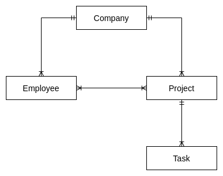

# Let's GO Fun The World
 
## What to do
Congratulation on making it this far, next step is going to be a hands-on project called **Let's go**. This project will
help you familiarize with the micro service architecture based on Golang, Cobra and Docker along with the service
structure, coding conventions and basic workflow. In this project, you are going to develop a simple Create, Read, Update,
Delete and List API resources for http client consumption. To have and overview on this project, please refer to the ERD below:

This project consists of 4 repositories:
1. [Let's Go Docker](https://github.com/dinhtp/lets-go)
2. [Let's Go Pbtype](https://github.com/dinhtp/lets-go-pbtype)
3. [Company Service](https://github.com/dinhtp/lets-go-company)
4. [Project Service](https://github.com/dinhtp/lets-go-project)

##  Prerequisite
- Preferred OS: Linux based (Ubuntu or Fedora).
- Complete setup environment.
- protoc v3.15.6
- protoc-gen-go v1.26.0
- Docker and docker compose with sudo permission.
- Git and Basic Git flow.
- Access to 4 **Let's go** project.
- Goland IDE (preferred).
- Postman (preferred).
- MySQL Workbench (preferred).

## How to use
### Docker command
In order to speed up the processing of spinning up the services with in the `docker-compose.yml` file, 
a few shell scripts are created to quickly get the LAN IP, bring up and down the docker services. It is also required to 
take a look inside those scripts to understand the logic behind each command.

During the first run or everytime your local machine LAN IP is changed, it is required to execute the `./start`
command before bring up the docker services. Usually, this command is executed only once during each active session.

- Run `./start` to populate the LAN IP to docker environment.
- Run `./up` to bring up all the services in the docker compose file.
- Run `./down` to bring down all the services in the docker compose file.

### GO Rest Service
Each Rest service written and built by Golang will carry a domain name defined in the `nginx.conf` file.
With each domain name, it is required to update the `hosts` file so that your local machine forward the request correctly.
For Linux users, the `hosts` file is located at `/etc/hosts` and or Windows users, at `C:\Windows\System32\drivers\etc\hosts`.

- Update the service domain name in the `hosts` file. For example: `127.0.0.1 api-go-company.local.com`
- To bring up all the services in the docker compose file, run `./up`
- Check if the service is up and running using `docker ps`

## Expected Output
### Docker
- Docker basic.
- Docker image and container.
- Image registry.
- Docker file.
- Docker basic command: ps, logs, run, exec.
- Docker compose file (structure, syntax, conventions).
- Docker service: image, command, env, volume, ports, name, network.
- Spin up the infrastructure services successfully in the docker compose file.

### Nginx
- Nginx basic.
- Nginx config file.
- Server name, proxy pass, rewrite rules.

> NOTE: DO NOT commit changes directly into the master branch.
